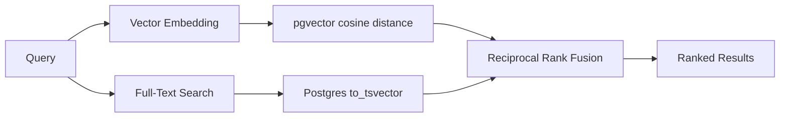

# Features

Corpus-KB turns your local files into a searchable, queryable knowledge base. This page explains what you can do once the server is running.

---

## Ingest anything

Send files, directories, or raw text into the pipeline. Corpus-KB detects the type automatically and chooses the right chunking strategy.

| Input | How it is handled |
|-------|-------------------|
| File | Detected by extension: code, markdown, or plain text |
| Directory | Recursively ingests every supported file |
| Raw text | Optional type hint: code, markdown, or text |

### Code chunking

Code files are split using tree-sitter. Chunks respect AST boundaries: functions, classes, and methods stay intact. Supported languages include Python, JavaScript, TypeScript, Rust, Go, Java, C, C++, and many more.

### Markdown chunking

Markdown is split at headings. Each section becomes a chunk with its heading path preserved, so search results know which section they came from.

### Text chunking

Plain text is split by semantic gaps. The chunker looks for topic shifts rather than cutting at fixed sizes, though `max_size` and `overlap` still apply.

### Pipeline stages

The ingest pipeline runs five stages:

1. **Partition** - Break the file into semantic elements.
2. **Chunk** - Group elements into coherent chunks.
3. **Embed** - Send each chunk to the configured embedding provider (Ollama or PostgresML) and store the vector in Postgres via pgvector.
4. **Extract** - Run the ontology-aware extractor to find entities and relations.
5. **Store** - Persist chunks, vectors, entities, and relations directly to Postgres. The event store records what happened for audit and replay.

If the embedding provider is unavailable, embedding falls back to zero vectors and the pipeline continues. Errors are collected in the response so you know what happened.

---

## Hybrid search

Search combines two signals and merges them with Reciprocal Rank Fusion.



- **Vector search** finds chunks that are semantically similar, even when the wording differs.
- **Full-text search** finds exact and near-exact keyword matches using Postgres `to_tsvector`.
- **RRF fusion** merges the two ranked lists into a single result list without needing calibrated scores.

You can filter by source type (`code`, `markdown`, `text`) and request surrounding context chunks.

---

## Knowledge graph

Entities and relations are first-class citizens. The extractor recognizes things like classes, functions, concepts, people, organizations, and products, then links them with typed relations such as `PART_OF`, `MENTIONS`, `DEFINED_AS`, and `RELATED_TO`.

You can:

- Search entities by name or type.
- Add entities and relations manually through the API or MCP tools.
- Traverse the graph with BFS from any starting entity.
- Query relations through Apache AGE Cypher if you enable the AGE extension.

---

## Tags and metadata

Organize documents without moving files.

- **Tags** are colored labels you can apply to any document.
- **Metadata** is a key-value store scoped to a document or global to the tenant.

Both are tenant-isolated through RLS and queryable through SQL.

---

## Versioning and time travel

Corpus-KB uses event sourcing. Every ingest, update, and delete appends an immutable event to the event store. Projections read those events and build the Postgres tables.

This gives you:

- A complete audit trail.
- The ability to replay projections from any point in time.
- Tagged checkpoints for important moments.

The event store is the source of truth; the Postgres tables are read models that can be rebuilt.

---

## Configurable embeddings

Switch embedding providers and models by changing `config.yaml`:

```yaml
embedding:
  provider: ollama  # "ollama" | "pgml"
  model: nomic-embed-text
  dimensions: 768
  batch_size: 32
```

For higher quality, use a larger model:

```yaml
embedding:
  provider: ollama
  model: qwen3-embedding:8b-q8_0
  dimensions: 4096
  batch_size: 128
```

To use PostgresML for in-database embeddings (requires the `pgml` extension):

```yaml
embedding:
  provider: pgml
  model: intfloat/e5-small-v2
  dimensions: 768
```

Make sure the `dimensions` value matches the model and that the `chunks_vectors` table was created with a compatible vector size. The default schema uses `vector(4096)` so either 768 or 4096 works as long as you keep the setting consistent.

---

## Multi-tenancy ready

Every table has row-level security policies keyed to `app.current_tenant_id`. The default tenant is `00000000-0000-0000-0000-000000000001`. In the future, adding real multi-tenancy is a matter of issuing tenant-scoped tokens and setting the tenant context per request.

---

## MCP tool reference

When connected through MCP, editors can call these tools:

| Category | Tool | Description |
|----------|------|-------------|
| Ingest | `ingest_file` | Ingest a single file |
| Ingest | `ingest_text` | Ingest raw text with a type hint |
| Ingest | `ingest_directory` | Recursively ingest a directory |
| Ingest | `list_documents` | List ingested documents |
| Ingest | `delete_document` | Delete a document |
| Search | `search` | Hybrid search |
| Search | `search_context` | Search with surrounding chunks |
| Search | `search_similar` | Find chunks similar to a given chunk |
| Search | `retrieve_context` | Search results formatted for LLM context |
| SQL | `sql_query` | Run a read-only SQL query |
| SQL | `sql_execute` | Run a safe write SQL query |
| SQL | `sql_tables` | List tables and schemas |
| Graph | `add_entity` | Add an entity |
| Graph | `add_relation` | Add a relation |
| Graph | `search_graph` | Search entities |
| Graph | `bfs` | BFS traversal |
| Graph | `get_entity_relations` | Get relations for an entity |
| Tags | `add_tag` | Create a tag |
| Tags | `tag_document` | Apply a tag |
| Tags | `untag_document` | Remove a tag |
| Tags | `get_document_tags` | List tags on a document |
| Metadata | `set_metadata` | Set metadata |
| Metadata | `get_metadata` | Retrieve metadata |
| Version | `list_versions` | List event store versions |
| Version | `create_tag` | Tag a version |
| Version | `checkout_version` | Time-travel read |
| Version | `restore_version` | Restore to a version |
| Version | `create_branch` | Create a branch |
| Version | `list_branches` | List branches |
| Version | `switch_branch` | Switch branch |
| Stats | `get_stats` | Database statistics |
| Stats | `query_document_stats` | Aggregate document statistics |

The full HTTP equivalents are listed in [API.md](API.md).

---

## Next steps

- [Install Corpus-KB](INSTALL.md)
- [Admin guide: configuration and maintenance](ADMIN.md)
- [API reference with curl examples](API.md)
- [Development guide](DEVELOPMENT.md)
- [FAQ](FAQ.md)
